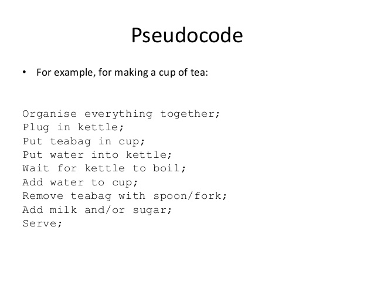
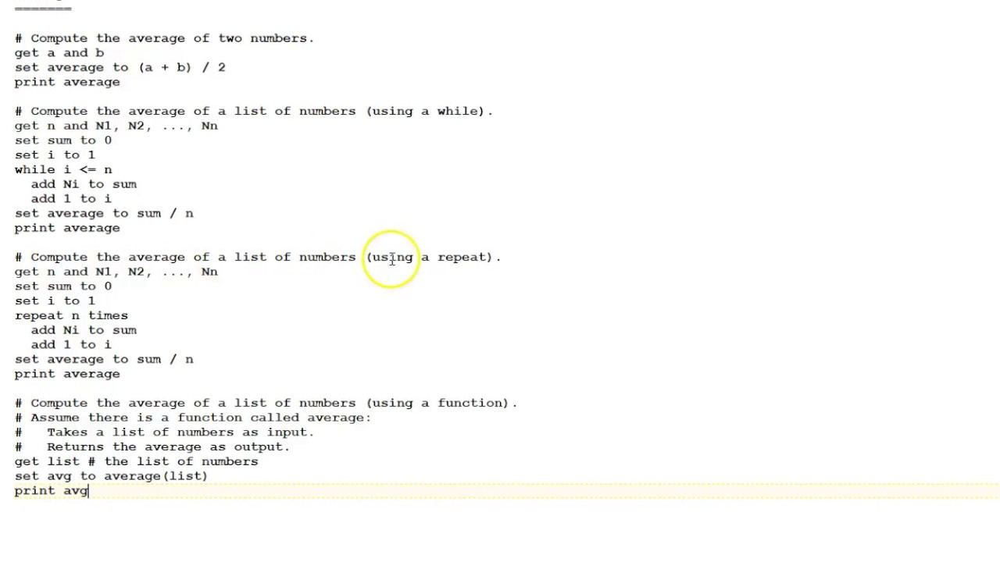
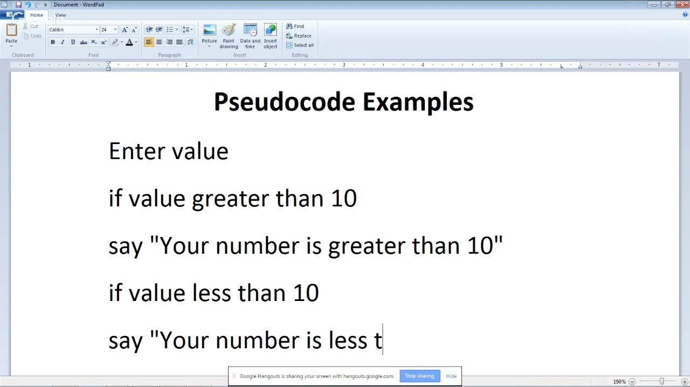

# Curso de análisis de datos con Python
#### Profesor: Gerardo Mathus @gemathus

## Temario:
1. [Entornos de desarollo y Jupyter Notebooks](../1_Entornos_de_desarrollo_y_Jupyer_Notebooks)
    - Instalación de Python
    - Repaso de línea de comando
    - Jupyter
    - Jupyter Notebooks
    - Instalación de Jupyter y Kernel de Python
2. [Control de versiones con Git](../2_Control_de_versiones_con_Git)
    - Github overview
    - Crear una cuenta
    - Github Nextia Academy
    - Clonar un repositorio
    - Git CLI
    - Jupter Notebooks en git
    - Crear repositorio de clase
    - Git pull
3. [Análisis y diseño de algoritmos en Python](../3_Analisis_y_diseño_de_algoritmos_en_Python)
    - Introducción a Python
    - Intérprete de Python
    - Archivos .py
    - Python en un Jupyter notebook
    - Tipos de datos
    - Variables
    - Booleanos
    - Operadores de comparación
    - Operadores lógicos
    - Sangrías
    - Listas
    - Tuplas
    - Diccionarios
    - Condicionales
    - Ciclo while
    - Ciclo for
    - Funciones
    - Lectura de archivos
    - Paquetes
4. [Estructuras en Numpy](../4_Estructuras_en_Numpy)
    - Intro a numpy
    - Instalación e importación
    - Numpy Arrays
    - Size y Shape
    - Indexing
    - Infinitos y NA
    - Media, mínimo y máximo
    - Crear nuevos objetos a partir de otro
    - Cambiar y manipular dimensión de un array
    - Secuencias, repeticiones y aleatorios
    - Valores únicos y frencuencias
5. [Exploración de datos con Pandas](../5_Exploracion_de_datos_con_Pandas)
    - Intro a Pandas
    - Instalación e importación
    - Core de Pandas: Series y DataFrame
    - Read
    - Exploración de datos
    - Valores nulos y limpieza
    - Guardar un nuevo DataFrame
    - Iteraciones vs. Vectorizaciones
    - Fechas
    - Indexing
    - Subconjunto de un DF
6. [Visualización de datos con Matplotlib y Seaborn](../6_Visualizacion_de_datos_con_Matplotlib_y_Seaborn)
7. [Análisis exploratorio geoespacial con Geopandas](../7_Analisis_exploratorio_geoespacial_con_Geopandas)

---

## Examen diagnóstico

Instrucciones: contesta el siguiente examen en el lenguaje de programación de tu preferencia, o bien, en pseudocódigo. Envía tus resspuetas al correo gerardo@nextia.mx

El examen lo encuentran en [aquí](examen_diagnostico.ipynb)

## Pseudocódigo
*Que se parece al código*

---

#### Ejemplo 1

---

#### Ejemplo 2

---

#### Ejemplo 3
